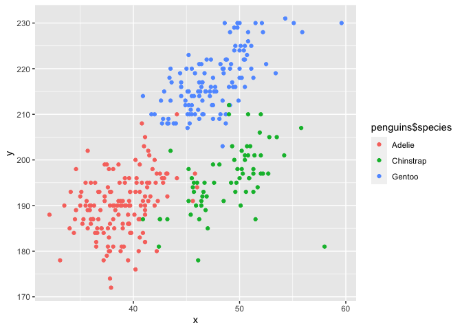

Homework 1 zz2901
================

## Problem 1

### Code for loading “`penguins`” dataset and descriptions

``` r
data("penguins", package = "palmerpenguins")
penguins
```

    ## # A tibble: 344 × 8
    ##    species island    bill_length_mm bill_depth_mm flipper_…¹ body_…² sex    year
    ##    <fct>   <fct>              <dbl>         <dbl>      <int>   <int> <fct> <int>
    ##  1 Adelie  Torgersen           39.1          18.7        181    3750 male   2007
    ##  2 Adelie  Torgersen           39.5          17.4        186    3800 fema…  2007
    ##  3 Adelie  Torgersen           40.3          18          195    3250 fema…  2007
    ##  4 Adelie  Torgersen           NA            NA           NA      NA <NA>   2007
    ##  5 Adelie  Torgersen           36.7          19.3        193    3450 fema…  2007
    ##  6 Adelie  Torgersen           39.3          20.6        190    3650 male   2007
    ##  7 Adelie  Torgersen           38.9          17.8        181    3625 fema…  2007
    ##  8 Adelie  Torgersen           39.2          19.6        195    4675 male   2007
    ##  9 Adelie  Torgersen           34.1          18.1        193    3475 <NA>   2007
    ## 10 Adelie  Torgersen           42            20.2        190    4250 <NA>   2007
    ## # … with 334 more rows, and abbreviated variable names ¹​flipper_length_mm,
    ## #   ²​body_mass_g

### Description for “`penguins`” dataset

-   The “`penguins`” dataset has variables **“species”, “island”,
    “bill_length_mm”, “bill_depth_mm”, “flipper_length_mm”,
    “body_mass_g”, “sex”, “year”**. Variable types include **factors**
    (“species”, “island”, “sex”), **doubles** (“bill_length_mm”,
    “bill_depth_mm”), and **integers** (“flipper_length_mm”,
    “body_mass_g”, “year”).

-   There are **344 rows and 8 columns** in the dataset.

-   After removing missing data, the **mean flipper length is 200.915
    mm**.

### Scatterplot for `flipper_length_mm` (y) vs `bill_length_mm` (x)

``` r
plot_df <- tibble(
  x = penguins$bill_length_mm,
  y = penguins$flipper_length_mm
)

ggplot(plot_df, aes(x = x, y = y, color = penguins$species)) + geom_point()
```

    ## Warning: Removed 2 rows containing missing values (geom_point).

<!-- -->

``` r
ggsave("scatter_plot_flipper_vs_bill_length.pdf")
```

    ## Saving 7 x 5 in image

    ## Warning: Removed 2 rows containing missing values (geom_point).

## Problem 2

### Create requested data frame `mean_df` and take mean of each variable

``` r
mean_df <- tibble(
  random_sample = rnorm(10),
  logical_vector = random_sample>0,
  character_vector = c("v1","v2","v3","v4","v5","v6","v7","v8","v9","v10"),
  factor_vector = factor(c("level_1","level_1","level_1","level_1","level_1","level_1",
                           "level_1","level_1","level_2","level_3"))
)
mean_df
```

    ## # A tibble: 10 × 4
    ##    random_sample logical_vector character_vector factor_vector
    ##            <dbl> <lgl>          <chr>            <fct>        
    ##  1       -1.43   FALSE          v1               level_1      
    ##  2        0.0287 TRUE           v2               level_1      
    ##  3       -0.912  FALSE          v3               level_1      
    ##  4        0.0348 TRUE           v4               level_1      
    ##  5        0.692  TRUE           v5               level_1      
    ##  6       -0.610  FALSE          v6               level_1      
    ##  7        0.563  TRUE           v7               level_1      
    ##  8       -0.493  FALSE          v8               level_1      
    ##  9        1.05   TRUE           v9               level_2      
    ## 10       -0.363  FALSE          v10              level_3

``` r
mean(mean_df$random_sample)
```

    ## [1] -0.1436815

``` r
mean(mean_df$logical_vector)
```

    ## [1] 0.5

``` r
mean(mean_df$character_vector)
```

    ## Warning in mean.default(mean_df$character_vector): argument is not numeric or
    ## logical: returning NA

    ## [1] NA

``` r
mean(mean_df$factor_vector)
```

    ## Warning in mean.default(mean_df$factor_vector): argument is not numeric or
    ## logical: returning NA

    ## [1] NA

We could calculate the means for `random_sample` and `logical_vector`.

But we could not calculate the means for `character_vector` or
`factor_vector`.
